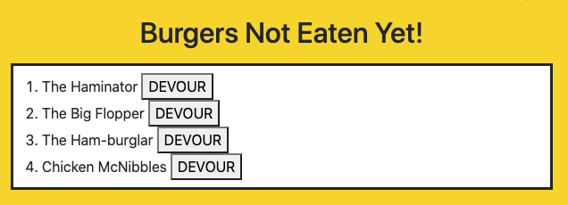
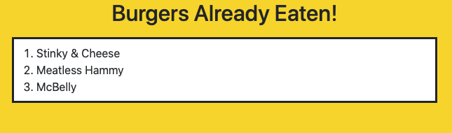
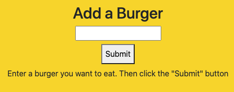

# burger

## Description
The repository contains the code used to create restaurant app that functions as a burger data logger. The application allows users to input the names of burgers they would like to eat and simulates a virtual eating mechanism. 

### Technologies 
* Javascript
* Node.js
* MySql

### Dependencies 
* mysql
* express
* express-handlebars

### Installation
In order to install necessary dependencies, please run the following command: npm i

### Functionality
Eat-Da-Burger uses mysql to house a database of burgers (both eaten and not-eaten) that the user inputs. The right side of the page displays the names of the "Burgers not eaten yet" and a "Devour" button while the right side displays the names of the "Burgers already eaten". The middle of the page has a form input where the user can enter the name of a new burger they would like to add. Once a new burger is entered, it will be added to the database and be displayed on the left side by default. Once the user clicks the "devour" button, the corresponding burger name will move to the right side of the page. 

### Preview

Example list of burgers not eaten yet + devour button

Example list of burgers already eaten

Input form to add a new burger

#### Links
[Link to application](https://eat-burger-application.herokuapp.com/)